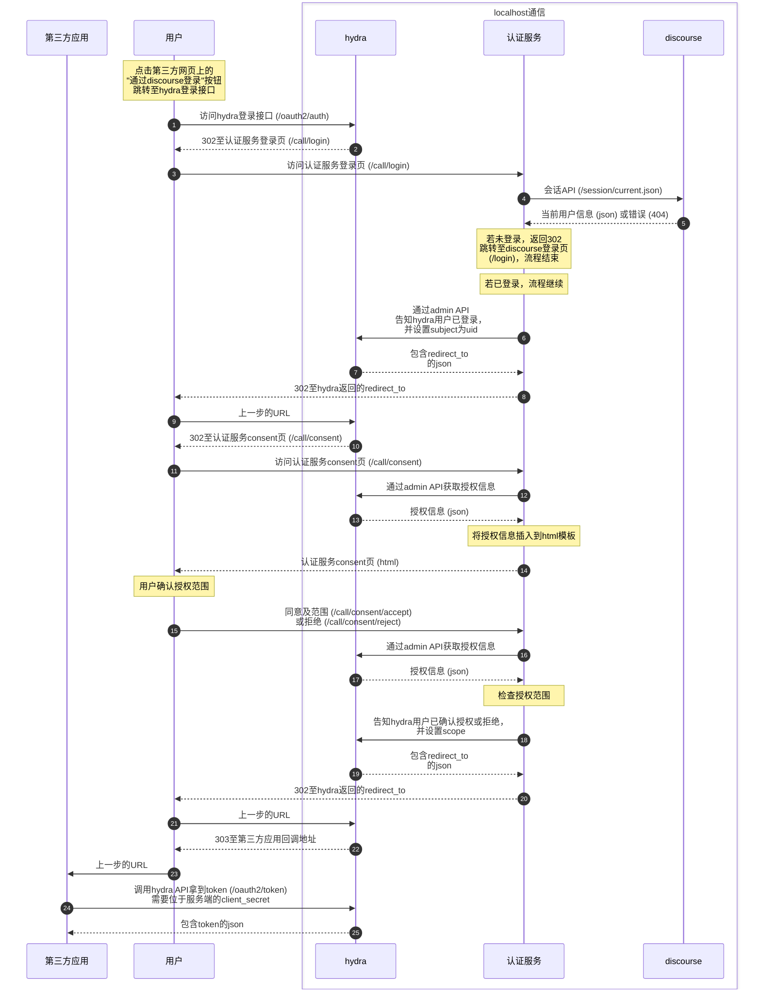

# 用hydra为discourse添加OAuth功能的尝试

## 前提条件

1. 您拥有discourse所在服务器的控制权，因为需要运行独立于discourse的程序以及修改nginx配置。
2. 您拥有站点的管理员权限，因为需要在管理员后台生成一个有管理员权限的ApiKey。

注意：本OAuth服务与discourse**使用同一个域名**。

## 认证流程



第三方拿到token后，有两种方案：

1. 将`access_token`和`refresh_token`（若有）保存在后端中，前端需要请求时，调用后端接口，由后端代为请求。
2. 除了将`access_token`保存在后端，也在前端保存一份，直接请求相关API提高响应速度，但结果应仅用于前端。

**注意事项**

当服务器需要信息时请从服务器访问相关API，避免身份伪造。

若您的应用是网页：

1. 请一定不要将`refresh_token`保存在浏览器中。<span style="color:#ff7777">浏览器无法安全存储`token`</span>。
2. 若在前端保存一份`access_token`，请提供一个刷新接口来代为刷新token。并且服务端必须同时保存所有token。

## 部署

### 数据库

使用`PostgreSQL`数据库，你可以复用`discourse`的`PostgreSQL`，新建一个数据库即可。

下面假设`PostgreSQL`已运行在`localhost:5432`。

1. 切换到`postgresql`用户并进入`postgresql`命令行

   `sudo -i -u postgres psql`

2. 在psql命令行中执行以下命令

若复制多行执行出错请单独复制每一行执行。

```sql
-- 创建 hydra 数据库
CREATE DATABASE hydra;

-- 创建 hydra 用户，请替换密码为你的强密码
CREATE USER hydra WITH PASSWORD 'your_password';

-- 授予 hydra 用户对 hydra 数据库的权限
GRANT ALL PRIVILEGES ON DATABASE hydra TO hydra;

-- 给予 hydra 用户对数据库 hydra 的 schema 权限
\c hydra

GRANT ALL PRIVILEGES ON SCHEMA public TO hydra;

-- 创建 oauth 数据库
CREATE DATABASE oauth;

-- 创建 oauth 用户，请替换密码为你的强密码
CREATE USER oauth WITH PASSWORD 'your_password';

-- 授予 oauth 用户对 oauth 数据库的权限
GRANT ALL PRIVILEGES ON DATABASE oauth TO oauth;

-- 给予 oauth 用户对数据库 oauth 的 schema 权限
\c oauth

GRANT ALL PRIVILEGES ON SCHEMA public TO oauth;

\c postgres

-- 给予用户 oauth 对数据库 hydra 的只读权限
GRANT CONNECT ON DATABASE hydra TO oauth;

\c hydra

GRANT USAGE ON SCHEMA public TO oauth;
GRANT SELECT ON ALL TABLES IN SCHEMA public TO oauth;
GRANT USAGE ON ALL SEQUENCES IN SCHEMA public TO oauth;
ALTER DEFAULT PRIVILEGES FOR ROLE hydra IN SCHEMA public GRANT SELECT ON TABLES TO oauth;
ALTER DEFAULT PRIVILEGES FOR ROLE hydra IN SCHEMA public GRANT USAGE ON SEQUENCES TO oauth;
ALTER DEFAULT PRIVILEGES FOR ROLE postgres IN SCHEMA public GRANT SELECT ON TABLES TO oauth;
ALTER DEFAULT PRIVILEGES FOR ROLE postgres IN SCHEMA public GRANT USAGE ON SEQUENCES TO oauth;

\c postgres
```

### hydra

1. 复制[`config_example.yaml`](./hydra/config_example.yaml)为`config.yaml`。
2. 替换所有`your.domain.com`为你的域名。
3. 将`secrets.system`中的`This_is_your_secret`替换为你的密钥，可用命令`openssl rand -hex 32`生成。
4. 将`dsn`中的数据库用户名、数据库名、密码、数据库地址等替换为你的配置，注意要url编码。
5. 执行命令`./hydra migrate sql --config config.yaml --yes`来连接数据库并新建表，正常应该无报错。
6. 运行[`run_dev.sh`](./hydra/run_dev.sh)启动服务端。
7. 在另一个ssh窗口，用命令 `curl http://127.0.0.1:4444/.well-known/openid-configuration` 验证。
8. 可选：修改[`hydra.service`](./hydra/hydra.service)并配置自启动。

### discourse

1. 进入discourse管理员后台API密钥管理界面 (`/admin/api/keys`)，点击`添加 API 密钥`
2. 描述填写有意义的字符串，如`OAuth User Profile`，用户级别`所有用户`，范围`只读`。
3. 妥善保存生成的`API KEY`备用，此`API KEY`具有管理员权限。

特别提醒：

范围你不能选择`精细`来手动选择允许的范围。
因为我们需要通过uid来获取用户资料，而`精细`-`users`-`show`中所列出的url并没有包含我们需要的url。
所以只能设为全局只读，此时允许的url是`*`，可以通过uid来获取用户资料。

截止`2026.3.0-latest.1`([12b79c7da6](https://github.com/discourse/discourse/commits/12b79c7da6785987d5071e9b6ab04795097760eb))
，仍然只能这样。

### server

1. 复制[`config_example.yaml`](./server/config_example.yaml)为`config.yaml`。
2. 配置文件的所有参数都要改成你的配置。

### nginx

由于与discourse共享域名，因此需要做路径分流，以nginx为例。

```text
location ~ ^/(\.well-known/(oauth-authorization-server|openid-configuration|jwks\.json)|oauth2(/.*)?)$ {
    proxy_pass http://127.0.0.1:4444; # hydra地址
    proxy_set_header Host $host;
    proxy_set_header X-Real-IP $remote_addr;
    proxy_set_header X-Forwarded-For $proxy_add_x_forwarded_for;
    proxy_set_header X-Forwarded-Proto $scheme;
    proxy_read_timeout 60s;
}

location /call {
    proxy_pass http://127.0.0.1:4440; # server地址
    proxy_set_header Host $host;
    proxy_set_header X-Real-IP $remote_addr;
    proxy_set_header X-Forwarded-For $proxy_add_x_forwarded_for;
    proxy_set_header X-Forwarded-Proto $scheme;
    proxy_read_timeout 60s;
}

location / {
    proxy_pass http://127.0.0.1:55929; # discourse地址
    proxy_set_header Host $host;
    proxy_set_header X-Real-IP $remote_addr;
    proxy_set_header X-Forwarded-For $proxy_add_x_forwarded_for;
    proxy_set_header X-Forwarded-Proto $scheme;
    proxy_read_timeout 60s;
}
```